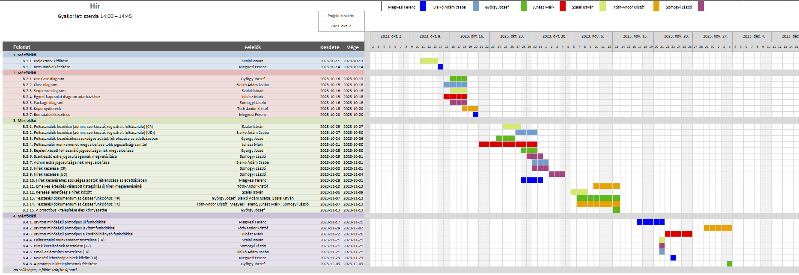

# `Hír` Projektterv `2023`

## 1. Összefoglaló 

`A friss hír elolvasása mindenki számára fontos, ezért létrehozunk egy weblapot, hogy a lehető leghatékonyabban juthasson el ez mindenkihez, hogy ne kelljen nyomtatott sajtóból értesülni, hanem naprakészen tudjon mindenki tájékozódni a világ történéseiről. A weboldal célja, hogy összegyűjtse a különböző hírportálok cikkeit és azok között lehessen keresni érdeklődéstől függően. Gyors és hatékony módja a hírolvasásnak és nem kell várni az új újságra reggelente, mivel mindig megkapjuk frissen a legújabb érdekességeket. Egyre több megbízhatatlan, hamis hír kering az interneten és azok kiszűrésére talál megoldást. `

### 2. A projekt bemutatása

`Ez a projektterv a Hír projektet mutatja be, amely 2023-10-12-től 2023-12-04-ig tart, azaz összesen 53 napon keresztül fog futni. A projekten hét fejlesztő fog dolgozni, az elvégzett feladatokat pedig négy alkalommal fogjuk prezentálni a megrendelőnek, annak érdekében, hogy biztosítsuk a projekt folyamatos előrehaladását. `

### 2.1. Rendszerspecifikáció

`A rendszernek képesnek kell lennie arra, hogy mindig elérhető cikkeket nyújtson. A felhasználok regisztrálhatnak, hogy saját érdeklődés szűrőt állítsanak be. A adminok törölhetnek híreket és tilthatnak felhasználókat. A szerkesztők hozzáadhatnak híreket az oldalra különböző hírportálokról. A felhasználók kaphatnak értesítést az új cikkekről a weboldalon. Hírlevélre íratkozhatnak fel, amiben az érdeklődésük alapján kapnak cikkeket. Keresni tudnak a hírek között. A felhasználó külön blokk-ban látja a legfrissebb híreket.`

### 2.2. Funkcionális követelmények

 - `Felhasználók kezelése (admin, szerkesztő, regisztrált felhasználó) (CRUD)`
 - `Regiszrációs űrlap (felhasználónév, email, jelszó, jelszó megerősítés, születési évszám)`
 - `Bejelentkezés űrlap (email, jelszó)`
 - `Vendég jogosultságai`
    - `Hírek olvasása`
    - `Kommentek olvasása`
    - `Keresési lehetőség a hírek között`
 -  `Bejelentkezett felhasználó jogosultságai`
    - `Felhasználói adatok módosítása (felhasználónév, születési dátum, jelszó)`
    - `Kedvenc kategóriák beállítása`
    - `Kijelentkezés`
    - `Fiók törlése`
    - `Kommentek írása`
 - `Szerkesztő extra jogosultágai`
    - `Hírek hozzáadása (cím, forrás, közzétevő neve)`
 - `Admin extra jogosultágai`
    - `Fiókok tiltása / tiltás feloldása`
    - `Kommentek törlése`
    - `Cikkek módosítása`
    - `Jogosultságok kiosztása`
 - `Felhasználói munkamenet megvalósítása több jogosultsági szinttel`
 - `Hírek kezelése (CRUD)`
 - `Email-es értesítés válaszott kategóriás új hírek megjelenésénél`

### 2.3. Nem funkcionális követelmények

 - `Reszponzív megjelenés`
 - `Friss technológiák használata`
 - `Böngészőfüggetlen kliensoldal`
 - `Érzékeny adatok biztonságosan tárolása`
 - `Dinamikus működés`

## 3. Költség- és erőforrás-szükségletek

Az erőforrásigényünk összesen `50` személynap, átlagosan `7` személynap/fő.

A rendelkezésünkre áll összesen `7 * 70 = 490` pont.

## 4. Szervezeti felépítés és felelősségmegosztás

A projekt megrendelője `Dr. Pflanzner Tamás`. A `Hír` projektet a projektcsapat fogja végrehajtani, amely `jelenleg hét fejlesztőből áll. A csapatban csak pályakezdő webprogramozó található.`
 - `Somogyi László (<1 év tapasztalat)`
 - `Bialkó Ádám Csaba (<1 év tapasztalat)`
 - `György József (<1 év tapasztalat)`
 - `Juhász Márk (<1 év tapasztalat)`
 - `Megyesi Ferenc (<1 év tapasztalat)`
 - `Szalai István (<1 év tapasztalat)`
 - `Tóth-Andor Kristóf (<1 év tapasztalat)`

### 4.1 Projektcsapat

A projekt a következő emberekből áll:

| Név                 | Pozíció                |   E-mail cím (stud-os)        |
|---------------------|------------------------|-------------------------------|
| `Megyesi Ferenc`    | Projektmenedzser       | `h161513@stud.u-szeged.hu`    |
| `Bialkó Ádám Csaba` | Projekt tag            | `h146841@stud.u-szeged.hu`    |
| `György József`     | Projekt tag            | `h158121@stud.u-szeged.hu`    |
| `Juhász Márk`       | Projekt tag            | `h263268@stud.u-szeged.hu`    |
| `Szalai István`     | Projekt tag            | `h164312@stud.u-szeged.hu`    |
| `Tóth-Andor Kristóf`| Projekt tag            | `h165690@stud.u-szeged.hu`    |
| `Somogyi László`    | Projekt tag            | `h163904@stud.u-szeged.hu`    |

## 5. A munka feltételei

### 5.1. Munkakörnyezet

A projekt a következő munkaállomásokat fogja használni a munka során:

 - `Munkaállomások: 6 db, Windows 10-es operációs rendszerrel, 2 Windows 11-es operációs rendszerrel, 1 Linux Mint 20.3 Cinnamon operációs rendszerrel`
 - `ASUS Rog Zephyrus 2021 (CPU: AMD Ryzen 9 4900HS, RAM: 16GB, GPU: NVIDIA GeForce RTX 2060)`
 - `PC (CPU: AMD Ryzen 5 5600x, RAM: 16GB, GPU: RX 6700XT)`
 - `ASUS ROG STRIX (CPU: AMD Ryzen 5600h, RAM: 16GB, GPU: RTX 3050 TI)`
 - `PC (CPU: Intel(R) Core(TM) i3-4160, RAM: 10GB, GPU: NVIDIA GeForce GT 740)`
 - `HUAWEI MATEBOOK D15 (CPU: Intel(R) Core(TM) i3-10110U, RAM: 8GB, GPU: Intel UHD Graphics)`
 - `PC (CPU: AMD Ryzen 5 2600, RAM: 16GB, GPU: GTX 1050TI`
 - `Lenovo Legion 5 (CPU: i7 10750H, RAM: 16GB, GPU: 1650TI)`
 - `HP ProBook 445G8 (CPU: AMD Ryzen 7 5800U, RAM: 32GB, GPU: Radeon Graphics 8)`
 - `PC (CPU: AMD Ryzen 5 2600x, RAM: 16GB, GPU: NVIDIA GeForce GTX 1660 SUPER)`

A projekt a következő technológiákat/szoftvereket fogja használni a munka során: 

 - `PostgreSQL adatbázis-kezelő rendszer`
 - `Spring Boot keretrendszer`
 - `Thymeleaf dinamikus tartalom megjelenítés a felhasználói felületen`
 - `Maven szoftverprojekt menedzselő szoftver`
 - `IntelliJ IDE fejlesztőkörnyezet`
 - `Git verziókövető (GitLab)`

### 5.2. Rizikómenedzsment

| Kockázat                  | Leírás                                                                                                                                                                                                                                                                  | Valószínűség | Hatás     |
|---------------------------|-------------------------------------------------------------------------------------------------------------------------------------------------------------------------------------------------------------------------------------------------------------------------|--------------|-----------|
| `Betegség`                | `A projektből egyszerre több személy is kieshet, ami hátráltathatja annak haladását. A problémát úgy lehetne orvosolni, hogy az érintetlenül maradt résztvevők munkáját növeljük.`                                                                                      | `közepes`    | `erős`    |
| `Gyűlésen való hiányzás`  | `Ezáltal a feladatkiosztás nem lesz egyértelmű, ami megnehezítheti a feladatok elvégzését, és előfordulhat, hogy egyesek több feladatot vállalnak, mint mások. Megoldásként érdemes értesíteni a meg nem jelent személyt, és szükség esetén átadni neki a feladatokat.` | `kis`        | `közepes` |
| `ZH-k sokasága`           | `A gyakori számonkérések miatt előfordulhat, hogy valaki nem tudja a elvégezni a neki kiszabott feladatokat egy adott időszakban. Megoldásként javasolt az ilyen időszakokra előre elkészíteni a feladatokat.`                                                          | `közepes`    | `közepes` |

## 6. Jelentések

### 6.1. Munka menedzsment
A munkát `Megyesi Ferenc` koordinálja. `Fő feladata, hogy folyamatosan egyeztessen a csapattagokkal az előrehaladásról és a fellépő problémákról, esetlegesen a megoldásban is segítséget nyújhat a projekt csúszásának elkerülése végett. További feladata a heti szinten tartandó csoportgyűlések időpontjának és helyszínének leszervezése, erről email-ben tájékoztatja a projektcsapatot.`

### 6.2. Csoportgyűlések

`A projekt hetente ülésezik, hogy megvitassák az azt megelőző hét problémáit, illetve hogy megbeszéljék a következő hét feladatait. A megbeszélésről minden esetben memó készül.`

`1. megbeszélés:`
 - `Időpont: 2023. 10. 15.`
 - `Hely: Online, Discord`
 - `Résztvevők: Megyesi Ferenc, Bialkó Ádám Csaba, György József, Juhász Márk, Szalai István, Tóth-Andor Kristóf, Somogyi László`
 - `Érintett témák: Ismerkedés, projekttéma kiválasztása, projektterv és Gantt diagram elkészítése`

`2. megbeszélés:`
- `Időpont: 2023. 10. 30.`
- `Hely: Online, Discord`
- `Résztvevők: Megyesi Ferenc, Bialkó Ádám Csaba, György József, Juhász Márk, Szalai István, Tóth-Andor Kristóf, Somogyi László`
- `Érintett témák: Projektterv kiegészítése, UML modellezés, adatbázistervek és képernyőtervek`

`3. megbeszélés:`
- `Időpont: 2023. 11. 17.`
- `Hely: Online, Discord`
- `Résztvevők: Bialkó Ádám Csaba, György József, Juhász Márk, Szalai István, Tóth-Andor Kristóf, Somogyi László`
- `Érintett témák: Harmadik mérföldkő feladatainak átbeszélése, kiosztása, félreértések tárgyalása, projektterv pontosítása. Megismerkedés a PostgreSQL-vel, adatbázis csatlakoztatása a projekthez...`

### 6.3. Minőségbiztosítás

Az elkészült terveket a terveken nem dolgozó csapattársak közül átnézik, hogy megfelel-e a specifikációnak és az egyes diagramtípusok összhangban vannak-e egymással. A meglévő rendszerünk helyes működését a prototípusok bemutatása előtt a tesztelési dokumentumban leírtak végrehajtása alapján ellenőrizzük és összevetjük a specifikációval, hogy az elvárt eredményt kapjuk-e. További tesztelési lehetőségek: unit tesztek írása az egyes modulokhoz vagy a kód közös átnézése (code review) egy, a vizsgált modul programozásában nem résztvevő csapattaggal. Szoftverünk minőségét a végső leadás előtt javítani kell a rendszerünkre lefuttatott kódelemzés során kapott metrikaértékek és szabálysértések figyelembevételével.
Az alábbi lehetőségek vannak a szoftver megfelelő minőségének biztosítására:
- Specifikáció és tervek átnézése
- Teszttervek végrehajtása
- Kód átnézése

### 6.4. Átadás, eredmények elfogadása

A projekt eredményeit a megrendelő, `Dr. Pflanzner Tamás` fogja elfogadni. A projektterven változásokat csak a megrendelő írásos engedélyével lehet tenni. A projekt eredményesnek bizonyul, ha specifikáció helyes és határidőn belül készül el. Az esetleges késések pontlevonást eredményeznek. 
Az elfogadás feltételeire és beadás formájára vonatkozó részletes leírás a következő honlapon olvasható: https://okt.inf.szte.hu/rf1/

### 6.5. Státuszjelentés

Minden mérföldkő leadásnál a projekten dolgozók jelentést tesznek a mérföldkőben végzett munkájukról a a megadott sablon alapján. A gyakorlatvezetővel folytatott csapatmegbeszéléseken a csapat áttekintik és felmérik az eredményeket és teendőket. Továbbá gazdálkodnak az erőforrásokkal és szükség esetén a megrendelővel egyeztetnek a projektterv módosításáról.

## 7. A munka tartalma

### 7.1. Tervezett szoftverfolyamat modell és architektúra

`A szoftver fejlesztése során az agilis fejlesztési modellt alkalmazzuk, mivel a fejlesztés során nagy hangsúlyt fektetünk a folyamatos kommunikációra. A fejlesztés során a szoftver specifikációi rugalmasan vátozhatnak, és ezzel a módszertannal tudunk a leggyorsabban alkalmazkodni az új elvárásokhoz.`

`A webalkalmazás az MVC (modell-view-controller) felépítést követi, a szerver és a kliens függetlenek, csupán API végpontok segítségével kommunikálnak.`

### 7.2. Átadandók és határidők

A főbb átadandók és határidők a projekt időtartama alatt a következők:

| Szállítandó |                 Neve                                                        |   Határideje  |
|:-----------:|:---------------------------------------------------------------------------:|:-------------:|
|      D1     |      Projektterv és Gantt chart, prezentáció, egyéni jelentés               | `2023-10-17`  |
|    P1+D2    |      UML, adatbázis- és képernyőtervek, prezentáció, egyéni jelentés        | `2023-10-24`  |
|    P1+D3    |      Prototípus I. és tesztelési dokumentáció, egyéni jelentés              | `2023-11-14`  |
|    P2+D4    |      Prototípus II. és frissített tesztelési dokumentáció, egyéni jelentés  | `2023-12-05`  |

## 8. Feladatlista

A következőkben a tervezett feladatok részletes összefoglalása található.

### 8.1. Projektterv (1. mérföldkő)

Ennek a feladatnak az a célja, hogy `megvalósításhoz szükséges lépéseket, az erőforrásigényeket, az ütemezést, a felelősöket és a feladatok sorrendjét meghatározzuk, majd vizualizáljuk Gantt diagram segítségével.`

Részfeladatai a következők:

#### 8.1.1. Projektterv kitöltése

Felelős: `Szalai István`

Tartam:  `7 nap`

Erőforrásigény:  `1 személynap/fő`

#### 8.1.2. Bemutató elkészítése

Felelős: `Megyesi Ferenc`

Tartam:  `0.5 nap`

Erőforrásigény:  `0.5 személynap`

### 8.2. UML és adatbázis- és képernyőtervek (2. mérföldkő)

Ennek a feladatnak az a célja, hogy `a rendszerarchitektúrát, az adatbázist és webalkalmazás kinézetét megtervezzük.`

Részfeladatai a következők:

#### 8.2.1. Use Case diagram

Felelős: `György József`

Tartam:  `3 nap`

Erőforrásigény:  `2 személynap`

#### 8.2.2. Class diagram

Felelős: `Bialkó Ádám Csaba`

Tartam:  `4 nap`

Erőforrásigény:  `2 személynap`

#### 8.2.3. Sequence diagram

Felelős: `Szalai István`

Tartam:  `3 nap`

Erőforrásigény:  `2 személynap`

#### 8.2.4. Egyed-kapcsolat diagram adatbázishoz

Felelős: `Juhász Márk`

Tartam:  `4 nap`

Erőforrásigény:  `2 személynap`

#### 8.2.5. Package diagram

Felelős: `Somogyi László`

Tartam:  `3 nap`

Erőforrásigény:  `2 személynap`

#### 8.2.6. Képernyőtervek

Felelős: `Tóth-Andor Kristóf`

Tartam:  `3 nap`

Erőforrásigény:  `1 személynap`

#### 8.2.7. Bemutató elkészítése

Felelős: `Megyesi Ferenc`

Tartam:  `1 nap`

Erőforrásigény:  `1 személynap`

### 8.3. Prototípus I. (3. mérföldkő)

Ennek a feladatnak az a célja, hogy `egy működő prototípust hozzunk létre, ahol a vállalt funkcionális követelmények nagy része már prezentálható állapotban van.` 

Részfeladatai a következők:

#### `8.3.1. Felhasználók kezelése (admin, szerkesztő, regisztrált felhasználó) (CR)`

Felelős: `Szalai István`

Tartam:  `3 nap`

Erőforrásigény:  `1.5 személynap`

#### `8.3.2. Felhasználók kezelése (admin, szerkesztő, regisztrált felhasználó) (UD)`

Felelős: `Bialkó Ádám Csaba`

Tartam:  `4 nap`

Erőforrásigény:  `2 személynap`

#### `8.3.3. Felhasználók kezeléséhez szükséges adatok létrehozása az adatbázisban`

Felelős: `György József`

Tartam:  `3 nap`

Erőforrásigény:  `1 személynap`

#### `8.3.4. Felhasználói munkamenet megvalósítása több jogosultsági szinttel`

Felelős: `Juhász Márk`

Tartam:  `10 nap`

Erőforrásigény:  `2 személynap`

#### `8.3.5. Bejelentkezett felhasználó jogosultságainak megvalósítása`

Felelős: `György József`

Tartam:  `3 nap`

Erőforrásigény:  `1 személynap`

#### `8.3.6. Szerkesztő extra jogosultágainak megvalósítása`

Felelős: `Somogyi László`

Tartam:  `3 nap`

Erőforrásigény:  `1 személynap`

#### `8.3.7. Admin extra jogosultágainak megvalósítása`

Felelős: `Bialkó Ádám Csaba`

Tartam:  `3 nap`

Erőforrásigény:  `1 személynap`

#### `8.3.8. Hírek kezelése (CR)`

Felelős: `Somogyi László`

Tartam:  `3 nap`

Erőforrásigény:  `1 személynap`

#### `8.3.9. Hírek kezelése (UD)`

Felelős: `Somogyi László`

Tartam:  `3 nap`

Erőforrásigény:  `1 személynap`

#### `8.3.10. Hírek kezeléséhez szükséges adatok létrehozása az adatbázisban`

Felelős: `Megyesi Ferenc`

Tartam:  `4 nap`

Erőforrásigény:  `1 személynap`

#### `8.3.11. Email-es értesítés válaszott kategóriás új hírek megjelenésénél`

Felelős: `Tóth-Andor Kristóf`

Tartam:  `4 nap`

Erőforrásigény:  `2 személynap`

#### `8.3.12. Keresési lehetőség a hírek között`

Felelős: `Szalai István`

Tartam:  `3 nap`

Erőforrásigény:  `0.5 személynap`

#### 8.3.13. Tesztelési dokumentum az összes funkcióhoz (TP)

Felelős: `György József`

Tartam:  `7 nap`

Erőforrásigény:  `1 személynap/fő`

#### 8.3.14. Tesztelési dokumentum az összes funkcióhoz (TC)

Felelős: `Tóth-Andor Kristóf, Megyesi Ferenc, Juhász Márk, Somogyi László`

Tartam:  `7 nap`

Erőforrásigény:  `1 személynap/fő`

#### `8.3.15. A prototípus kitelepítése éles környezetbe` 

Felelős: `Megyesi Ferenc`

Tartam:  `1 nap`

Erőforrásigény:  `1 személynap`

### 8.4. Prototípus II. (4. mérföldkő)

Ennek a feladatnak az a célja, hogy `az előző mérföldkő hiányzó funkcióit pótoljuk, illetve a hibásan működő funkciókat és az esetlegesen felmerülő új funkciókat megvalósítsuk. Továbbá az alkalmazás alapos tesztelése is a mérföldkőben történik az előző mérföldkőben összeállított tesztesetek alapján.`

Részfeladatai a következők:

#### 8.4.1. Javított minőségű prototípus új funkciókkal

Felelős: `Megyesi Ferenc`

Tartam:  `5 nap`

Erőforrásigény:  `2.5 személynap`

#### 8.4.2. Javított minőségű prototípus javított funkciókkal

Felelős: `Tóth-Andor Kristóf`

Tartam:  `5 nap`

Erőforrásigény:  `2 személynap`

#### 8.4.3. Javított minőségű prototípus a korábbi hiányzó funkciókkal

Felelős: `Juhász Márk`

Tartam:  `5 nap`

Erőforrásigény:  `1.5 személynap`

#### `8.4.4. Felhasználói munkamenet tesztelése (TR)`

Felelős: `Szalai István`

Tartam:  `1 nap`

Erőforrásigény:  `1 személynap`

#### `8.4.5. Hírek kezelésének tesztelése (TR)`

Felelős: `Somogyi László`

Tartam:  `1 nap`

Erőforrásigény:  `0.5 személynap`

#### `8.4.6. Email-es értesítés tesztelése (TR)`

Felelős: `Bialkó Ádám Csaba`

Tartam:  `1 nap`

Erőforrásigény:  `1 személynap`

#### `8.4.7. Keresési lehetőség a hírek között (TR)`

Felelős: `Megyesi Ferenc`

Tartam:  `1 nap`

Erőforrásigény:  `0.5 személynap`

#### `8.4.8. A prototípus kitelepítésének frissítése`

Felelős: `György József`

Tartam:  `1 nap`

Erőforrásigény:  `0.5 személynap`

## 9. Részletes időbeosztás

## 10. Projekt költségvetés

### 10.1. Részletes erőforrásigény (személynap)

| Név                 |   M1  |   M2  | M3  | M4    | Összesen |
|---------------------|-------|-------|-----|-------|----------|
| `Megyesi Ferenc`    | `1.5` | `1`   |`2.5`| `3`   | `8`      |
| `Bialkó Ádám Csaba` | `1`   | `2`   | `4` | `1`   | `8`      |
| `Szalai István`     | `1`   | `2`   | `4` | `1`   | `8`      |
| `György József`     | `1`   | `2`   |`3.5`| `0.5` | `7`      |
| `Tóth-Andor Kristóf`| `1`   | `1`   | `3` | `2`   | `7`      |
| `Juhász Márk`       | `1`   | `2`   | `3` | `1.5` | `7.5`    |
| `Somogyi László`    | `1`   | `2`   | `4` | `0.5` | `7.5`    |

### 10.2. Részletes feladatszámok

| Név                 |   M1  |   M2  | M3  | M4  | Összesen |
|---------------------|-------|-------|-----|-----|----------|
| `Megyesi Ferenc`    | `2`   | `1`   | `2` | `1` | `6`      |
| `Bialkó Ádám Csaba` | `1`   | `1`   | `3` | `1` | `6`      |
| `Szalai István`     | `1`   | `1`   | `4` | `1` | `7`      |
| `György József`     | `1`   | `1`   | `3` | `1` | `7`      |
| `Tóth-Andor Kristóf`| `1`   | `1`   | `2` | `1` | `5`      |
| `Juhász Márk`       | `1`   | `1`   | `2` | `1` | `5`      |
| `Somogyi László`    | `1`   | `1`   | `4` | `1` | `7`      |

### 10.3. Részletes költségvetés

| Név                                 | M1      | M2   | M3   | M4   | Összesen  |
|-------------------------------------|---------|------|------|------|-----------|
| Maximálisan megszerezhető pontszám  |  (7)    | (20) | (35) | (28) | 100% (70) |
| `Megyesi Ferenc`                    | `7`     | `16` | `28` | `19` | 70        | 
| `Bialkó Ádám Csaba`                 | `6`     | `18` | `25` | `21` | 70        |   
| `Szalai István`                     | `6`     | `17` | `35` | `12` | 70        |
| `György József`                     | `6`     | `20` | `22` | `22` | 70        |
| `Tóth-Andor Kristóf`                | `6`     | `14` | `32` | `18` | 70        |       
| `Juhász Márk`                       | `6`     | `16` | `33` | `15` | 70        | 
| `Somogyi László`                    | `6`     | `19` | `26` | `19` | 70        |     

Szeged, `2023-10-15`.
